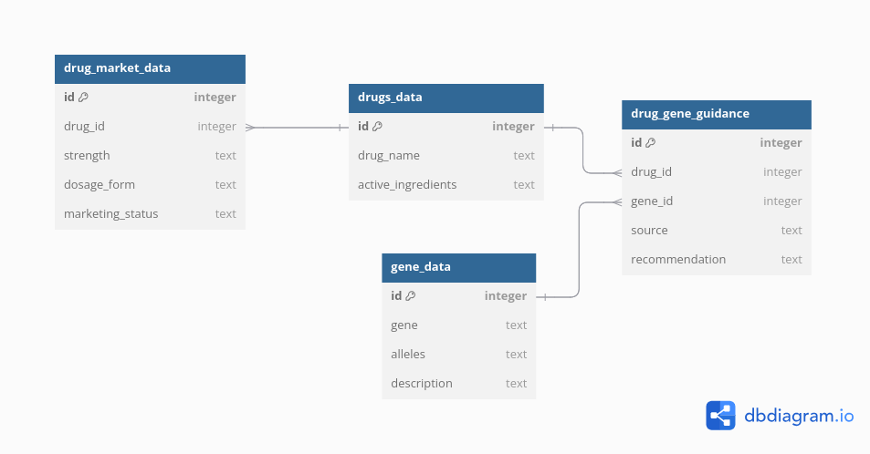

# Personalised Medicine poc

## SImple Search Tool to find FDA and NPIC recommendations for a drug for the genome type.


### Steps
- Populate database. Run load_database.py by running
```sh
python3 load_database.py
```
- This creates drug.db , creates tables and also populates it with values.

- To run the tool, Run search_tool.py by running
```sh
streamlit run search_tool.py
```
- This opens the tool in a web browser. Select the gene and allele combination from the drop down. Also select the source of information. If you want to view all , select all and click on search.


### DB Schema

